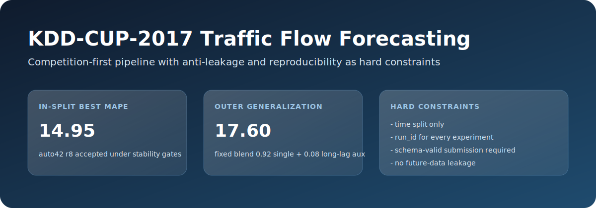
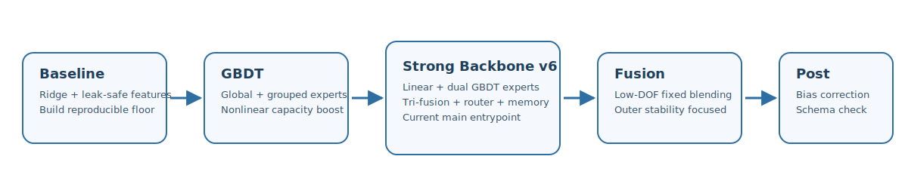

# KDD-CUP-2017-TrafficFlow

[](./requirements.txt)
[](#)
[](#)
[](#)
[](#)

竞赛优先的收费站流量预测项目。核心目标是：
在**严格防泄漏**前提下持续优化 MAPE，并保持**科研级可复现**。



## 为什么这个仓库值得看
- 问题真实：KDD Cup 2017 收费站车流预测，20 分钟粒度。
- 约束严格：只允许时间切分，不允许随机切分选模。
- 证据完整：每次实验必须有 `run_id`，并落盘配置、指标和产物。
- 结果清晰：in-split 稳健主线约 `14.95`，outer 泛化候选约 `17.60`。

## 技术路线（一眼看懂）



主线演进：`baseline -> gbdt -> strong backbone -> fusion -> post-process`

- `baseline`: 建立 leak-safe、可复跑的下限。
- `gbdt`: 补足非线性表达能力。
- `strong backbone v6`: 线性分支 + 双 GBDT 专家 + tri-fusion。
- `fusion`: 低自由度固定融合，优先稳健泛化。
- `post-process`: 偏差修正 + submission schema 校验。

## 快速开始（建议顺序）
1. 先读 [docs/START_HERE.md](docs/START_HERE.md)（当前唯一主线入口与禁做事项）。
2. 再看索引：
   - [docs/README.md](docs/README.md)
   - [configs/README.md](configs/README.md)
   - [scripts/README.md](scripts/README.md)
3. 开始编码前，先更新 [docs/vibe_coding_protocol.md](docs/vibe_coding_protocol.md)。

## Daily Commands
```bash
# 1) In-split 主线（当前默认）
python3 scripts/run_strong_backbone_v6.py \
  --config configs/strong_backbone_v6_density_r2_glw_r1_auto42_r8_score_shift.json \
  --run-id <your_run_id>

# 2) Outer 泛化辅助分支（long-lag）
python3 scripts/run_gbdt_pipeline.py \
  --config configs/gbdt_target12_generalize_51_r1_longlag_global_uniform.json \
  --run-id <your_run_id>

# 3) 防泄漏与治理检查
python3 scripts/check_leakage_guardrails.py \
  --config configs/strong_backbone_v6_density_r2_glw_r1_auto42_r8_score_shift.json \
  --run-id <your_run_id> \
  --skip-artifact-check
```

## 实验治理闭环（每轮都必须执行）


硬约束：
- 时间切分验证是唯一允许的模型选择方式。
- 特征与标签不得使用未来信息。
- 每个实验必须有唯一 `run_id`。
- submission 必须通过 schema 校验。
- 不更新 `docs/vibe_coding_protocol.md` 不提交。

## 项目结构
- `configs/`: 运行配置（参数真源）
- `src/`: 数据、特征、模型、评估、提交核心代码
- `scripts/`: 可执行入口脚本
- `docs/`: 协议、路线、报告、复盘
- `outputs/`: 实验产物（默认忽略）

## 展示与答辩材料
如果你需要直接用于答辩或汇报，优先看：
- [docs/project_intro/README.md](docs/project_intro/README.md)
- [docs/project_intro/02_non_tech_20min_script.md](docs/project_intro/02_non_tech_20min_script.md)
- [docs/project_intro/03_ppt_12_pages_talktrack.md](docs/project_intro/03_ppt_12_pages_talktrack.md)
- [docs/project_intro/04_attempts_and_lessons.md](docs/project_intro/04_attempts_and_lessons.md)

## License
内部竞赛研究仓库，数据遵循原竞赛平台与数据提供方约束。
